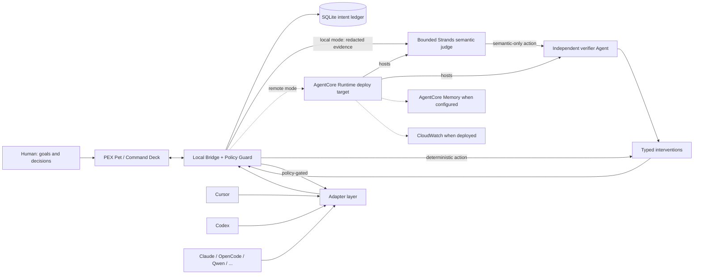

# PEX

**PEX turns you from a full-time manager of AI agents into the owner of goals and decisions.**

It is a goal-aware adaptive supervisor that lives *above* Cursor, Codex, Claude Code, OpenCode, and other coding agents you already use. It is not another coding harness, not a Kanban board, and not a chat UI that makes you babysit a babysitter.

## The pain it removes

Running several long-lived coding agents created a new job: remembering the real goal, noticing drift, catching false “done”, approving the same safe test command, copying context between windows, and typing “continue”.

PEX attaches to those sessions and does that mechanical work. You keep intent, priorities, and irreversible decisions.

## Why this is not another orchestrator

PEX does not require work to start inside PEX. Existing tools stay usable. Context belongs to the project/goal, not a chat transcript. Interventions are typed, policy-gated, reversible when possible, and audited.

## Supported harnesses

| Harness | Current label | Surface |
| --- | --- | --- |
| Synthetic | Deep | In-process reference adapter (tests/demo) |
| Cursor | Strong / Basic / Unavailable | Official hooks are Strong; optional verified ACP without hook observation is Basic |
| Codex | Deep / Observe-only / Unavailable | Isolated `codex app-server` JSON-RPC when attached. ChatGPT.exe is observe/focus only. |
| OpenCode | Deep / Unavailable | `opencode serve` HTTP when attached |
| Qwen Code | Strong / Basic / Unavailable | Strong only after negotiated HTTP plus a session-bound SSE stream, or a live official hook |
| Claude Code, Kimi, Grok Build, OMP, Hermes | Strong / Basic / Unavailable | Provider hooks/plugins or capability-gated ACP; Hermes hook-only is Basic |
| Devin | Basic / Unavailable | Thinner official organization API |
| Pi | Unavailable | Registered target; no verified provider-specific adapter yet |
| Grok Bot | Observe-only | Not Grok Build |
| Prime, ZCode, DeepSeek | Unavailable | Registered targets pending exact provider-specific integrations |

See [`INTEGRATIONS.md`](INTEGRATIONS.md) for the live matrix.

## Pets

The desktop has a compact command surface plus a separate transparent,
always-on-top pet overlay. It supervises existing harnesses; it is not a chat UI.

- Plays **Codex v2** atlases (`1536×2288`, `spriteVersionNumber: 2`): pointer movement selects one of sixteen look directions, a dwell hops, dragging moves the overlay with running animation, and click opens the PEX inspector.
- Import a hatch-pet folder (`pet.json` + `spritesheet.webp`), including a pet already installed under `~/.codex/pets/`.
- Settings can authorize exactly one potentially billable image call for an unverified custom-pet base candidate through an explicitly configured image provider (`PEX_HATCH_*` or the canonical OpenAI Images endpoint). It does not build an atlas or playable pet; grounded 8×11 assembly and independent QA are still required before import. Text-only or unauthorized endpoints fail honestly.
- Current source contains exactly eight built-ins: Pex, Ledger, Mesh, Nudge, Drift, Quiet, Ember, and Von. This is a source-fleet claim, not proof of a current packaged release. Custom imports and unfinished hatch candidates remain separate from that built-in catalog.

## Benchmark headline

Four-arm experiment: Cursor / Cursor+PEX / Codex / Codex+PEX.

Paired arms share one `TASK.md` and equivalent workspaces. The PEX supervisor decides in an isolated process on public observations only. The deterministic manifest deliberately retains the five recovery-spec tasks and is **unfrozen**: existing local rows predate the current suite/integrity contract, the natural public-repository task requirement is unsatisfied, and Cursor+PEX still lacks proven same-session continuation. **There is no citeable impact score or validated public leaderboard rank yet.** Do not cite quarantined leakage runs.

## Quick start

### Windows source prerequisites

This repository currently provides a **source-development bootstrap**, not a
packaged installer. Install Git and `uv`, Node matching [`.node-version`](.node-version),
and Rust matching [`rust-toolchain.toml`](rust-toolchain.toml). A Windows Tauri
build also needs the Microsoft C++ build tools and WebView2 runtime. `uv` uses
the Python version in [`.python-version`](.python-version) and installs the
workspace, test tools, and PyInstaller into `.venv`; do not substitute an
unrelated global Python.

From the repository root, run:

```powershell
.\scripts\install.ps1
npm --prefix apps/desktop run tauri dev
```

The setup script checks the required command-line tools, runs `uv sync --dev`,
uses the locked npm dependency graph with `npm ci`, and prepares all three
required desktop sidecars: the bridge, Cursor control hook, and Cursor observer.
It stops on a failed native command. It does **not** install hooks or modify
Cursor's global configuration. To run those steps manually:

```powershell
uv sync --dev
npm --prefix apps/desktop ci
npm --prefix apps/desktop run prepare:sidecar
npm --prefix apps/desktop run tauri dev
```

Tauri starts its owned authenticated bridge, proves its identity with a fresh
nonce, and only then releases its in-memory bearer to the local UI. An unknown
process already occupying port 7420 makes startup fail closed. A successful
source build is not evidence that a packaged installer or release bundle passed
its clean-profile checks.

### Connect a worker

Connect or start a real worker before attaching a persistent goal. The current
Agents view discovers candidates but has no generic worker **Attach** button;
the Inspector's **Attach goal** control only binds a stored goal to an already
live vendor session.

For OpenCode, start the official server in the exact worker project first:

```powershell
Set-Location C:\path\to\worker-project
opencode serve --port 4096
```

Then set its loopback origin before starting PEX from a second shell:

```powershell
$env:PEX_OPENCODE_URL="http://127.0.0.1:4096"
npm --prefix apps/desktop run tauri dev
```

If the OpenCode server uses Basic authentication, give both processes the same
official `OPENCODE_SERVER_USERNAME` and `OPENCODE_SERVER_PASSWORD` values. PEX
rejects credentials embedded in the URL and does not treat a desktop TUI process
as the HTTP control surface. The optional session-scoped overlay is documented
in [`integrations/opencode-plugin/README.md`](integrations/opencode-plugin/README.md).

If Codex CLI is installed, this starts a new isolated Codex App Server transport;
it does not take control of ChatGPT.exe or an arbitrary existing Codex task:

```powershell
$env:PEX_CODEX_ATTACH="1"
npm --prefix apps/desktop run tauri dev
```

Cursor hook installation is a separate, explicit opt-in. This source command
changes the current user's `~/.cursor/hooks.json`, writes observe-only hooks that
refer to this checkout, and backs up an existing file as
`hooks.json.pex-backup`:

```powershell
uv run python integrations/cursor-hook/install.py
```

Observe-only hooks do not prove that a continuation reached the same Cursor
worker. Do not run that command merely to install PEX dependencies, and do not
move or delete the checkout while those source-backed hooks are active. The
scoped hook credential for a chosen project is provisioned separately in
**Settings → Worker integrations** before starting the hooked worker.

For rollback, inspect both `hooks.json` and `hooks.json.pex-backup` first. The
backup is only the state seen immediately before the most recent PEX install;
later Cursor or user edits may exist in the current file. Do not restore the
backup blindly. If it is the confirmed desired pre-install state and no later
entries must be retained, close Cursor before restoring that reviewed file.
Otherwise remove only the PEX command entries and preserve every unrelated
hook. There is not yet an automated uninstall command.

### Configure PEX and attach intent

With no supervisor provider configured, PEX stays on deterministic triage and
reports `used_llm=false`; it does not invent model-backed supervision. To enable
semantic supervision, open **Settings → Supervisor inference**, select the
provider/model and credential source, and save it. Provider setup is independent
of worker attachment.

After a genuine vendor session appears, create or select a stored goal and use
the Inspector's **Attach goal** control. Only then should supervised work begin.
On a genuinely attached control surface, PEX can inspect evidence and issue a
specific policy-gated continuation. Observe-only surfaces never claim delivery.

Raw-browser no-auth operation is not available from an environment variable or
release CLI; it exists only inside explicit in-process Python test harnesses via
`Settings.for_test(...)`.

## Architecture




User input is the pet and persistent goals. Each semantic inspection can create a
fresh bounded Strands supervisor with request-scoped, read-only evidence tools
for canonical goal/session state, events, context, decisions, workspace/git/file
inspection, configured verification, and bounded public-web evidence. Exact
sanitized tool returns are captured as request-, event-, stage-, and
invocation-bound observations; the model must cite valid observation IDs for a
non-NOOP proposal. A returned observation proves what the tool returned, not
that the model understood it or that an intervention helped. A model-originated
STOP intervention must also pass a fresh independent verifier Agent using its
own observations and invocation. Timeout, malformed output, missing evidence,
or rejection becomes NOOP. Deterministic verification truth and local policy
still own the final boundary. Bedrock AgentCore Runtime is a hardened deploy
target, not a deployed-service claim. These behaviors have local contract
coverage; fresh provider-live two-Agent and real Codex closed-loop receipts are
still required for demo evidence.

The cloud supervisor can propose actions. It cannot bypass local policy.

Full diagram notes: [`docs/architecture/hackathon.md`](docs/architecture/hackathon.md).

## Hackathon

Built for the AWS + Devpost [Agents for Humans Hackathon](https://agentsforhumans.devpost.com/), Professional Agents track. Uses Strands Agents in the local supervisor and targets Amazon Bedrock AgentCore Runtime; AgentCore is not currently deployed. Overall contest state is **NO-GO**: no submission, deploy, freeze, or installer package is authorized until live closed-loop evidence exists. Canonical Devpost draft: [`docs/SUBMISSION.md`](docs/SUBMISSION.md). The four-arm manifest stays `frozen: false` with no citeable impact score.

- License: MIT
- Devpost copy and demo script: [`docs/SUBMISSION.md`](docs/SUBMISSION.md)
- Spec: [`docs/PEX_BUILD_SPEC.md`](docs/PEX_BUILD_SPEC.md)
- Hackathon/AWS track: [`docs/HACKATHON_TRACK.md`](docs/HACKATHON_TRACK.md)
- Why not an orchestrator: [`docs/DIFFERENTIATION.md`](docs/DIFFERENTIATION.md)
- Status: [`STATUS.md`](STATUS.md)
