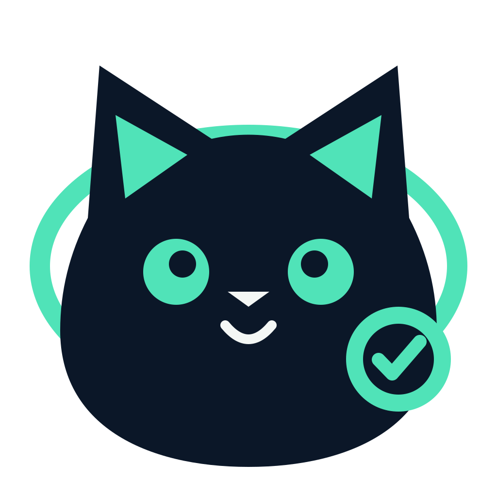
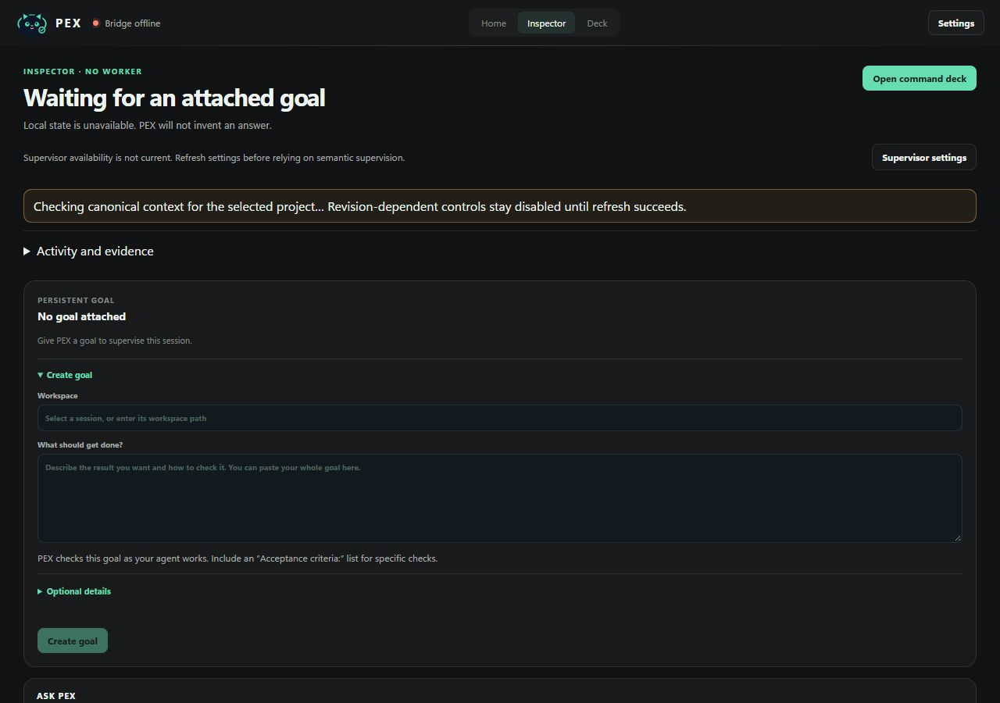

<p align="center">
  
</p>

# PEX

**PEX turns you from a full-time manager of AI agents into the owner of goals and decisions.**

It is a goal-aware supervisor for coding agents you already use. Connect a
worker, give it a persistent goal, and inspect the evidence behind PEX's
decisions from a compact workspace. OpenCode and Codex are the primary paths;
the supervisor model is configured separately with your own key.

**Current development: Nebius × NVIDIA Global AI Hackathon.** The workspace
prioritizes the goal, worker list and supervision state, with the companion and
advanced settings behind optional disclosures. Nebius Token Factory is a named
BYOK provider with NVIDIA Nemotron model suggestions. Suggestions are not proof
of account access: refresh the configured provider's catalog and verify a real
supervision run before claiming hackathon readiness.

<details>
<summary>Historical release evidence — September 14, 2026</summary>

**Verified local MVP — 14 September 2026.** The shipping focus is OpenCode,
Codex App Server, Zen BYOK and exactly two controllable companions, Pex and Von.
Cross-platform release source **`600d1de`** has a zero-blocker Windows MSI/NSIS
package receipt, 305 passing desktop tests on Windows with four expected
symbolic-link permission skips, and 309 passing desktop tests on Ubuntu,
4,578 passing backend tests with 32 environment skips, and a 1,358-test focused
Codex/Strands/AgentCore gate with one environment skip. RC7 packages Windows
x64 and Linux x64; Linux package construction and packaged-bridge startup pass,
while final visual acceptance on physical Linux hardware remains requested.

The fresh release-source OpenCode pair used the same task and free worker model:
without PEX the worker stopped with an independently failing test; with PEX it
recovered to an independently passing test. A separate correctly completed task
produced model-backed `NOOP` and zero follow-ups. Codex App Server control is
covered by the focused gate, but was not rerun as a live paired benchmark for
RC6. These are controlled behavioral examples, not a formal comparative
benchmark or leaderboard result. RC7 changes packaging and verification code,
not that supervisor behavior; the live pair was not rerun for RC7.

The immediately preceding candidate passed native Home/Settings, exactly two
pets, transparent Von, independent message dismissal, separate overlay Hide,
Escape-to-hide, bridge liveness and ordinary
shutdown. RC7 passed Windows package identity and authenticated bridge startup;
its Ubuntu build passed packaged bridge identity/settings startup as well. A 20.48-minute local
release run remained responsive across ten owned processes and ended near 640
MiB aggregate working set / 323 MiB private; a fresh RC7 recording-laptop visual
click-through remains required, especially on Linux. This is bounded evidence, not an indefinite leak
claim. AgentCore is
implemented and locally tested but
**not AWS-deployed**. The formal four-arm benchmark is unfrozen and has no valid
score. Final recording remains. See the
[judge guide](docs/JUDGE_TESTING.md) and the
[architecture overview](docs/architecture/overview.md).

</details>



*RC13 browser presentation capture of the current harness layout. Browser mode intentionally cannot read
the desktop bridge bearer, so unavailable canonical state stays visibly disabled
instead of being invented. Authenticated live and package evidence is retained in
the [judge guide](docs/JUDGE_TESTING.md).*

## The pain it removes

Running several long-lived coding agents created a new job: remembering the real goal, noticing drift, catching false “done”, approving the same safe test command, copying context between windows, and typing “continue”.

PEX attaches to those sessions and does that mechanical work. You keep intent, priorities, and irreversible decisions.

## Why this is not another orchestrator

PEX does not require work to start inside PEX. Existing tools stay usable. Context belongs to the project/goal, not a chat transcript. Interventions are typed, policy-gated, reversible when possible, and audited.

## Supported harnesses

| Harness | Current label | Surface |
| --- | --- | --- |
| Synthetic | Deep | In-process reference adapter (tests/demo) |
| Cursor | Strong / Basic / Unavailable | Official hooks are Strong; optional verified ACP without hook observation is Basic |
| Codex | Deep / Observe-only / Unavailable | Isolated `codex app-server` JSON-RPC when attached. ChatGPT.exe is observe/focus only. |
| OpenCode | Deep / Unavailable | `opencode serve` HTTP when attached |
| Qwen Code | Strong / Basic / Unavailable | Strong only after negotiated HTTP plus a session-bound SSE stream, or a live official hook |
| Claude Code, Kimi, Grok Build, OMP, Hermes | Strong / Basic / Unavailable | Provider hooks/plugins or capability-gated ACP; Hermes hook-only is Basic |
| Devin | Basic / Unavailable | Thinner official organization API |
| Pi | Unavailable | Registered target; no verified provider-specific adapter yet |
| Grok Bot | Observe-only | Not Grok Build |
| Prime, ZCode, DeepSeek | Unavailable | Registered targets pending exact provider-specific integrations |

See [`INTEGRATIONS.md`](INTEGRATIONS.md) for the live matrix.

Judges and evaluators can follow the focused [testing guide](docs/JUDGE_TESTING.md)
for the OpenCode/Nebius path and its exact claim boundaries.

## Pets

The desktop is designed around a compact command surface and a separate transparent,
always-on-top pet overlay. Transparency and controls passed bounded native checks;
prolonged stability is not yet claimed. It supervises existing harnesses.

- Exactly two companions: **Pex**, the owl, and **Von**, the dark-navy cat, selected in Settings → Companion.
- Uses reviewed **Codex v2** atlases (`1536×2288`, `spriteVersionNumber: 2`), restrained playback and manual dragging. The overlay does not roam or hop on hover.
- Separate controls hide the pet or dismiss only its status message; the pet can be restored from Settings. Both actions were observed independently in native checks.
- Custom imports and image generation are disabled in this MVP, including their write APIs. Existing legacy import metadata is preserved; retired selections fall back to Pex.
- Both current installer inventories contain only Pex and Von. See the [judge guide](docs/JUDGE_TESTING.md) for the focused evaluation path and remaining limits.

## Benchmark status

The current unfrozen integrity protocol still defines Cursor / Cursor+PEX /
Codex / Codex+PEX. It predates the focused OpenCode-and-Codex product scope and
is not a product-aligned impact benchmark. The next coherent protocol revision
must replace the Cursor pair with OpenCode / OpenCode+PEX before any headline
performance claim is eligible.

Paired arms share one `TASK.md` and equivalent workspaces. The PEX supervisor decides in a separate process on public observations only. The deterministic development smoke has five recovery tasks plus three source-pinned public QuixBugs repairs and is **unfrozen**: the harness mix is not aligned with the shipping scope, an OS-enforced hidden-data/no-network worker boundary is still missing, and existing rows predate the current 32-row suite/integrity contract. **There is no citeable impact score or validated public leaderboard rank yet.** Do not cite quarantined leakage runs.

A current five-task Codex-only paired diagnostic is retained in
[`docs/evidence/codex-paired-diagnostic-7cfc7f4.json`](docs/evidence/codex-paired-diagnostic-7cfc7f4.json).
Both arms passed all five controlled recovery tasks with no human intervention.
The PEX arms made five isolated local decisions and correctly sent no follow-up.
Across one run per arm and task, PEX averaged 3.20 seconds faster while the
median pair was 8.98 seconds slower; tool calls were 82 versus 90. Supervisor
inference was disabled to prevent paid Nebius usage. This is restraint and
overhead evidence, not a productivity score, and the rows remain outside the
presentation benchmark.

A current ten-task OpenCode diagnostic is retained in
[`docs/evidence/opencode-deterministic-paired-diagnostic-63dc5cd.json`](docs/evidence/opencode-deterministic-paired-diagnostic-63dc5cd.json).
Both exact-source arms passed 10/10 public artifact tasks. With PEX attached,
every event journal settled, all ten completion-event reviews produced a local
deterministic `NOOP`, no worker follow-up was sent, and no supervisor model call
was made. The observed mean and median wall-time deltas were -1.92 and -1.97
seconds. This validates attachment, observation, deterministic policy, restraint,
and bounded overhead; semantic supervision was disabled and no general
productivity claim is made.

## Quick start

### Install PEX

Download the package for your x64 computer from
[PEX 0.1.0 RC22](https://github.com/josepha-mayo/pex/releases/tag/v0.1.0-rc22).

**Windows 10/11:** use `PEX_0.1.0_x64-setup.exe` for the normal install.
The binary is not code-signed, so Windows may show a publisher warning.

**Ubuntu, Debian, Linux Mint, Pop!_OS:** download the `.deb`, then run:

```bash
sudo apt install ./PEX_0.1.0_amd64.deb
```

Linux needs a graphical desktop and a normal Secret Service/keyring (for
example GNOME Keyring or KWallet) to save a BYOK key through Settings. The
exact-commit CI gate built the Debian package on Ubuntu 24.04 and booted its
packaged bridge; it did not visually exercise every Linux desktop environment.
Other graphical x64 Linux users can use `PEX_0.1.0_amd64.AppImage`.
macOS and ARM64 packages are not available in RC22.

All RC22 packages are built from exact product source
`60c0eeb20cc658f0289994bff22a396ea23b2d1e`. The Windows installer SHA-256 is
`246f9f53188a2564374c5034ca5daaaf6331c70393e9840b0bbe26266478a8a6`;
the Debian package SHA-256 is
`504aa4ed15faae4ad15d05b5ba807be6f9c66afaa36e6e050d34a13bd1044235`;
and the AppImage SHA-256 is
`c56011b522fd48f14a38bfa30a227730b7cd5892f22fe422414c54f3fbd89f69`.
The release also includes `SHA256SUMS`.
Package integrity is not indefinite stability or publisher trust; current
source-bound behavior and trust boundaries are summarized in the [architecture overview](docs/architecture/overview.md).

Use the [judge testing guide](docs/JUDGE_TESTING.md) before evaluating this release, or build current source below.

### Build from source

To build from source instead,
use the development workflow below; it is not a packaged installer.
Install Git and `uv`, Node matching [`.node-version`](.node-version),
and Rust matching [`rust-toolchain.toml`](rust-toolchain.toml). A Windows Tauri
build also needs the Microsoft C++ build tools and WebView2 runtime. `uv` uses
the Python version in [`.python-version`](.python-version) and installs the
workspace, test tools, and PyInstaller into `.venv`; do not substitute an
unrelated global Python.

From the repository root, run:

```powershell
.\scripts\install.ps1
npm --prefix apps/desktop run tauri dev
```

The setup script checks the required command-line tools, runs `uv sync --dev`,
uses the locked npm dependency graph with `npm ci`, and prepares all three
required desktop sidecars: the bridge, Cursor control hook, and Cursor observer.
It stops on a failed native command. It does **not** install hooks or modify
Cursor's global configuration. To run those steps manually:

```powershell
uv sync --dev
npm --prefix apps/desktop ci
npm --prefix apps/desktop run prepare:sidecar
npm --prefix apps/desktop run tauri dev
```

Tauri starts its owned authenticated bridge, proves its identity with a fresh
nonce, and only then releases its in-memory bearer to the local UI. An unknown
process already occupying port 7420 makes startup fail closed. A successful
source build is not evidence that a packaged installer or release bundle passed
its clean-profile checks. Native desktop startup explicitly uses the standard
`~/.pex/pex.sqlite` profile; ambient `PEX_HOME` or `PEX_DB_PATH` values from a
benchmark shell do not redirect the owned bridge. Provider configuration remains
explicit and local as documented below.

### Connect a worker

Connect or start a real worker before attaching a persistent goal. The current
Agents view discovers candidates but has no generic worker **Attach** button;
the Inspector's **Attach goal** control only binds a stored goal to an already
live vendor session.

For OpenCode, start the official server in the exact worker project first:

```powershell
Set-Location C:\path\to\worker-project
opencode serve --port 4096
```

Keep that server running. In another terminal, attach the OpenCode interface to
the **same** server and create or resume a worker session there:

```powershell
opencode attach http://127.0.0.1:4096
```

A newly started server may have no sessions: connecting PEX alone does not
create one. Running plain `opencode` in another terminal can open a different
backend; use the explicit attach address. Configure the worker's provider/model
in OpenCode separately from PEX's supervisor provider. These commands follow the
[official OpenCode CLI interface](https://opencode.ai/docs/cli/#attach).

In PEX, choose **Connect a worker → Connect your local OpenCode server**, enter
`http://127.0.0.1:4096`, then choose **Connect OpenCode**. Return Home, select the
worker and set its persistent goal. Connecting does not start a worker turn.
The quick-connect form supports optional OpenCode Basic credentials for a
loopback server; do not put provider keys or credentials in the server address.

Alternatively, set the loopback origin before starting PEX from a second shell:

```powershell
$env:PEX_OPENCODE_URL="http://127.0.0.1:4096"
npm --prefix apps/desktop run tauri dev
```

If the OpenCode server uses Basic authentication, give both processes the same
official `OPENCODE_SERVER_USERNAME` and `OPENCODE_SERVER_PASSWORD` values. PEX
rejects credentials embedded in the URL and does not treat a desktop TUI process
as the HTTP control surface. The optional session-scoped overlay is documented
in [`integrations/opencode-plugin/README.md`](integrations/opencode-plugin/README.md).

If Codex CLI is installed, this starts a new isolated Codex App Server transport;
it does not take control of ChatGPT.exe or an arbitrary existing Codex task:

```powershell
$env:PEX_CODEX_ATTACH="1"
npm --prefix apps/desktop run tauri dev
```

Cursor hook installation is a separate, explicit opt-in. This source command
changes the current user's `~/.cursor/hooks.json`, writes observe-only hooks that
refer to this checkout, and backs up an existing file as
`hooks.json.pex-backup`:

```powershell
uv run python integrations/cursor-hook/install.py
```

Observe-only hooks do not prove that a continuation reached the same Cursor
worker. Do not run that command merely to install PEX dependencies, and do not
move or delete the checkout while those source-backed hooks are active. The
scoped hook credential for a chosen project is provisioned separately in
**Settings → Worker integrations** before starting the hooked worker.

For rollback, inspect both `hooks.json` and `hooks.json.pex-backup` first. The
backup is only the state seen immediately before the most recent PEX install;
later Cursor or user edits may exist in the current file. Do not restore the
backup blindly. If it is the confirmed desired pre-install state and no later
entries must be retained, close Cursor before restoring that reviewed file.
Otherwise remove only the PEX command entries and preserve every unrelated
hook. There is not yet an automated uninstall command.

### Configure PEX and attach intent

With no supervisor provider configured, PEX stays on deterministic triage and
reports `used_llm=false`; it does not invent model-backed supervision. To enable
semantic supervision, open **Settings → Supervisor**, select the
provider/model and credential source, and save it. Provider setup is independent
of worker attachment.

After a genuine vendor session appears, create or select a stored goal and use
the Inspector's **Attach goal** control. Only then should supervised work begin.
On a genuinely attached control surface, PEX can inspect evidence and issue a
specific policy-gated continuation. Observe-only surfaces never claim delivery.

Raw-browser no-auth operation is not available from an environment variable or
release CLI; it exists only inside explicit in-process Python test harnesses via
`Settings.for_test(...)`.

### Nebius Token Factory + NVIDIA Nemotron

In **Settings → Supervisor**, choose **Nebius Token Factory**, select an
account-supported NVIDIA model, paste the key and save. Keys go into the OS
credential store; Linux needs an unlocked Secret Service or KWallet backend.
Unsaved drafts survive background refreshes. If another client changes the saved
configuration, reload explicitly before saving again.

To pause automatic model reviews while keeping the provider and key saved, open
**Settings → Supervisor → Automatic reviews**, set the saved review limit to
`0`, and choose **Save supervisor**. This stops new semantic dispatches; it does
not cancel a review already in flight. A positive limit counts review
dispatches, not dollars or individual model calls. Saving the key alone does
not make a model call.

Alternatively, configure the process environment before launching PEX:

```text
PEX_SUPERVISOR_PROVIDER=nebius
PEX_SUPERVISOR_MODEL=nvidia/nemotron-3-super-120b-a12b
NEBIUS_API_KEY=<your Token Factory key>
```

The default endpoint is `https://api.tokenfactory.nebius.com/v1`.
A custom compatible endpoint is an explicit credential destination: provide a key
for that endpoint in Settings or through `PEX_SUPERVISOR_API_KEY`. PEX does not
forward another provider's key to it. See the
[official Nebius Nemotron example](https://github.com/nebius/token-factory-cookbook/blob/main/models/nemotron/nemotron3-super-120B.md).

Push and pull-request checks run the offline backend suite, desktop contracts,
lint and frontend production build on Windows and Ubuntu. Live provider calls,
native visual acceptance and installer testing remain separate checks.

## Architecture


Editable references: [SVG](docs/architecture/pex-architecture.svg) and
[Mermaid](docs/architecture/pex-architecture.mmd). Regenerate the submission
PNG with `python scripts/render_architecture.py`.

User input is the pet and persistent goals. Each semantic inspection can create a
fresh bounded Strands supervisor with request-scoped, read-only evidence tools
for canonical goal/session state, events, context, decisions, workspace/git/file
inspection, configured verification, and bounded public-web evidence. Exact
sanitized tool returns are captured as request-, event-, stage-, and
invocation-bound observations; the model must cite valid observation IDs for a
non-NOOP proposal. A returned observation proves what the tool returned, not
that the model understood it or that an intervention helped. A model-originated
STOP intervention must also pass a fresh independent verifier Agent using its
own observations and invocation. Timeout, malformed output, missing evidence,
or rejection becomes NOOP. Deterministic verification truth and local policy
still own the final boundary. Bedrock AgentCore Runtime is a hardened deploy
target, not a deployed-service claim. The current Nebius/OpenCode source retains
one controlled false-claim recovery and one already-correct quiet control.
Nemotron Super requested a bound pytest run, the same OpenCode session repaired
the failing parser, an independent rerun passed, and the final review stayed
quiet; the control produced `NOOP` with zero PEX follow-ups. See
[`docs/evidence/nebius-opencode-proof.json`](docs/evidence/nebius-opencode-proof.json).
This bounded pair does not prove broad quiet statistics, AgentCore deployment,
or a comparative benchmark result.

The cloud supervisor can propose actions. It cannot bypass local policy.

Full diagram notes: [`docs/architecture/hackathon.md`](docs/architecture/hackathon.md).

## Hackathon

Current target: the [Nebius × NVIDIA Global AI Hackathon](https://nebiusglobalaihackathon.devpost.com/),
Coding and Agentic Engineering track. The
[official rules](https://nebiusglobalaihackathon.devpost.com/rules) require runtime
use of Nebius Token Factory or AI Cloud and an NVIDIA open-source model.
Submission closes October 30, 2026 at 17:00 UTC. An existing project must explain
its significant new work. The retained product proof is an actual stopped
worker recovered through a Nemotron-backed PEX review with an independently
verified result, plus a separate quiet control. A public demo under three
minutes is still required. This is not a completed submission or a claim of
measured benefit.

PEX originated in the AWS Agents for Humans hackathon and still uses Strands
locally. AgentCore remains optional and is not deployed. The current
[submission draft](devpost-submission.md) targets Nebius × NVIDIA and explains
the significant updates made during this submission period. No comparative
benchmark score is claimed.

- License: MIT
- Devpost copy: [`devpost-submission.md`](devpost-submission.md)
- Architecture: [`docs/architecture/overview.md`](docs/architecture/overview.md)
- Hackathon diagram: [`docs/architecture/hackathon.md`](docs/architecture/hackathon.md)
- Official requirement matrix: [`docs/HACKATHON_REQUIREMENTS.md`](docs/HACKATHON_REQUIREMENTS.md)
- Why not an orchestrator: [`docs/DIFFERENTIATION.md`](docs/DIFFERENTIATION.md)
