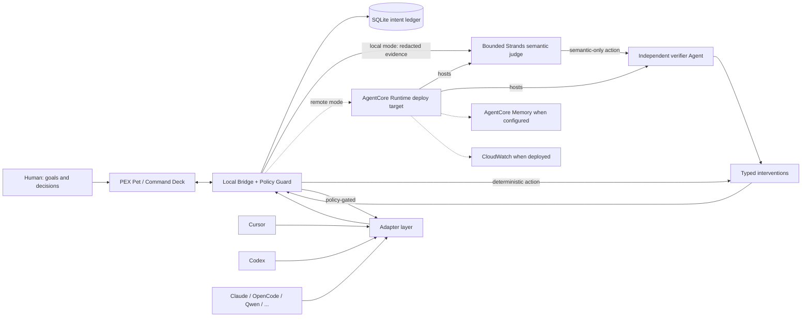

# PEX

**PEX turns you from a full-time manager of AI agents into the owner of goals and decisions.**

It is a goal-aware adaptive supervisor that lives *above* Cursor, Codex, Claude Code, OpenCode, and other coding agents you already use. It is not another coding harness, not a Kanban board, and not a chat UI that makes you babysit a babysitter.

## The pain it removes

Running several long-lived coding agents created a new job: remembering the real goal, noticing drift, catching false “done”, approving the same safe test command, copying context between windows, and typing “continue”.

PEX attaches to those sessions and does that mechanical work. You keep intent, priorities, and irreversible decisions.

## Why this is not another orchestrator

PEX does not require work to start inside PEX. Existing tools stay usable. Context belongs to the project/goal, not a chat transcript. Interventions are typed, policy-gated, reversible when possible, and audited.

## Supported harnesses

| Harness | Current label | Surface |
| --- | --- | --- |
| Synthetic | Deep | In-process reference adapter (tests/demo) |
| Cursor | Strong / Basic / Unavailable | Official hooks are Strong; optional verified ACP without hook observation is Basic |
| Codex | Deep / Observe-only / Unavailable | Isolated `codex app-server` JSON-RPC when attached. ChatGPT.exe is observe/focus only. |
| OpenCode | Deep / Unavailable | `opencode serve` HTTP when attached |
| Qwen Code | Strong / Basic / Unavailable | Strong only after negotiated HTTP plus a session-bound SSE stream, or a live official hook |
| Claude Code, Kimi, Grok Build, OMP, Hermes | Strong / Basic / Unavailable | Provider hooks/plugins or capability-gated ACP; Hermes hook-only is Basic |
| Devin | Basic / Unavailable | Thinner official organization API |
| Pi | Unavailable | Registered target; no verified provider-specific adapter yet |
| Grok Bot | Observe-only | Not Grok Build |
| Prime, ZCode, DeepSeek | Unavailable | Registered targets pending exact provider-specific integrations |

See [`INTEGRATIONS.md`](INTEGRATIONS.md) for the live matrix.

## Pets

The desktop has a compact command surface plus a separate transparent,
always-on-top pet overlay. It supervises existing harnesses; it is not a chat UI.

- Plays **Codex v2** atlases (`1536×2288`, `spriteVersionNumber: 2`): pointer movement selects one of sixteen look directions, a dwell hops, dragging moves the overlay with running animation, and click opens the PEX inspector.
- Import a hatch-pet folder (`pet.json` + `spritesheet.webp`), including a pet already installed under `~/.codex/pets/`.
- Settings can authorize exactly one potentially billable image call for an unverified custom-pet base candidate through an explicitly configured image provider (`PEX_HATCH_*` or the canonical OpenAI Images endpoint). It does not build an atlas or playable pet; grounded 8×11 assembly and independent QA are still required before import. Text-only or unauthorized endpoints fail honestly.
- Current source contains exactly eight built-ins: Pex, Ledger, Mesh, Nudge, Drift, Quiet, Ember, and Von. This is a source-fleet claim, not proof of a current packaged release. Custom imports and unfinished hatch candidates remain separate from that built-in catalog.

## Benchmark headline

Four-arm experiment: Cursor / Cursor+PEX / Codex / Codex+PEX.

Paired arms share one `TASK.md` and equivalent workspaces. The PEX supervisor decides in an isolated process on public observations only. The deterministic manifest deliberately retains the five recovery-spec tasks and is **unfrozen**: existing local rows predate the current suite/integrity contract, the natural public-repository task requirement is unsatisfied, and Cursor+PEX still lacks proven same-session continuation. **There is no citeable impact score or validated public leaderboard rank yet.** Do not cite quarantined leakage runs.

## Quick start

Run the authenticated desktop and its owned bridge sidecar:

```bash
cd pex
uv sync
cd apps/desktop
npm install
npm run tauri dev
```

Tauri builds and starts its authenticated sidecar, proves the sidecar identity
with a fresh nonce, and only then releases its in-memory bearer
to the local UI. Worker hooks use separately provisioned, project- and
session-bound credentials; they never read the operator bearer or token file.
An unknown process already occupying port 7420 makes startup fail closed.

Attach a persistent goal, then run a coding agent as usual. On a genuinely attached control surface, PEX can inspect evidence and issue a specific policy-gated continuation. Observe-only surfaces never claim delivery.

If OpenCode is already serving locally, set its URL before starting Tauri:

```bash
$env:PEX_OPENCODE_URL="http://127.0.0.1:4096"
npm run tauri dev
```

If Codex CLI is installed (including the local `.codex` plugin binary):

```bash
$env:PEX_CODEX_ATTACH="1"
npm run tauri dev
```

Desktop development uses `npm run tauri dev`, which starts the same authenticated
owned sidecar boundary as the packaged app. Raw-browser no-auth operation is not
available from an environment variable or release CLI; it exists only inside
explicit in-process Python test harnesses via `Settings.for_test(...)`.

## Architecture




User input is the pet and persistent goals. Each semantic STOP inspection creates a fresh bounded Strands supervisor with six request-scoped, read-only evidence tools (`get_goal`, `get_session_state`, `get_recent_events`, `get_scores`, `get_context`, `run_verification`) and requires a validated structured decision. A model-originated intervention that is not already required by deterministic evidence must then pass a fresh independent verifier Agent; timeout, malformed output, rejection, or an evidence-free approval becomes NOOP. Deterministic verification truth and local policy still own the final boundary. Tool calls and both model cycles are recorded. The old unused verifier Graph was removed; side-effect tools, public-web tools, and a Strands Graph are not claimed. Bedrock AgentCore Runtime is a hardened deploy target, not a deployed-service claim. These behaviors have local contract coverage; fresh provider-live two-Agent and real Codex closed-loop receipts are still required for demo evidence.

The cloud supervisor can propose actions. It cannot bypass local policy.

Full diagram notes: [`docs/architecture/hackathon.md`](docs/architecture/hackathon.md).

## Hackathon

Built for the AWS + Devpost [Agents for Humans Hackathon](https://agentsforhumans.devpost.com/), Professional Agents track. Uses Strands Agents in the local supervisor and targets Amazon Bedrock AgentCore Runtime; AgentCore is not currently deployed. Overall contest state is **NO-GO**: no submission, deploy, freeze, or installer package is authorized until live closed-loop evidence exists. Canonical Devpost draft: [`docs/SUBMISSION.md`](docs/SUBMISSION.md). The four-arm manifest stays `frozen: false` with no citeable impact score.

- License: MIT
- Devpost copy and demo script: [`docs/SUBMISSION.md`](docs/SUBMISSION.md)
- Spec: [`docs/PEX_BUILD_SPEC.md`](docs/PEX_BUILD_SPEC.md)
- Hackathon/AWS track: [`docs/HACKATHON_TRACK.md`](docs/HACKATHON_TRACK.md)
- Why not an orchestrator: [`docs/DIFFERENTIATION.md`](docs/DIFFERENTIATION.md)
- Status: [`STATUS.md`](STATUS.md)
