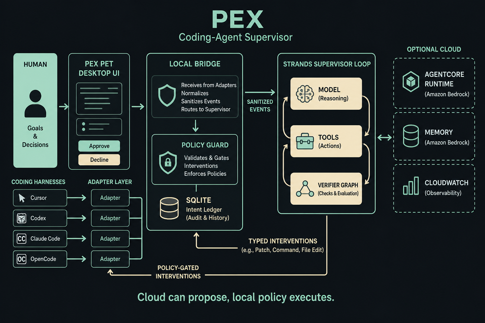
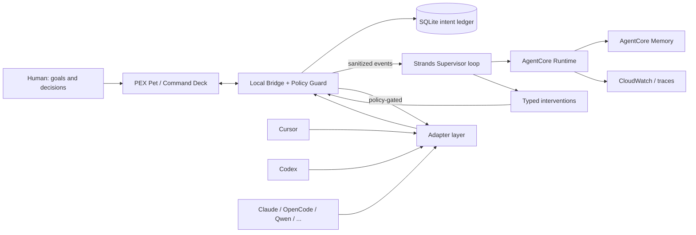

# PEX

**PEX turns you from a full-time manager of AI agents into the owner of goals and decisions.**

It is a goal-aware adaptive supervisor that lives *above* Cursor, Codex, Claude Code, OpenCode, and other coding agents you already use. It is not another coding harness, not a Kanban board, and not a chat UI that makes you babysit a babysitter.

## The pain it removes

Running several long-lived coding agents created a new job: remembering the real goal, noticing drift, catching false “done”, approving the same safe test command, copying context between windows, and typing “continue”.

PEX attaches to those sessions and does that mechanical work. You keep intent, priorities, and irreversible decisions.

## Why this is not another orchestrator

PEX does not require work to start inside PEX. Existing tools stay usable. Context belongs to the project/goal, not a chat transcript. Interventions are typed, policy-gated, reversible when possible, and audited.

## Supported harnesses

| Harness | Current label | Surface |
| --- | --- | --- |
| Synthetic | Deep | In-process reference adapter (tests/demo) |
| Cursor | Strong → Deep | Official hooks; ACP when a Cursor binary is configured |
| Codex | Deep / Unavailable | `codex app-server` JSON-RPC when attached |
| OpenCode | Deep / Unavailable | `opencode serve` HTTP when attached |
| Qwen Code | Deep / Unavailable | `qwen serve` HTTP+SSE when attached |
| Claude Code, Kimi, Grok Build, OMP, Hermes | Strong | Official hooks / ACP / plugins |
| Devin, Pi | Basic | Thinner official APIs |
| Grok Bot | Observe-only | Not Grok Build |
| Prime, ZCode, DeepSeek | Experimental | Bound when the exact runtime is identified |

See [`INTEGRATIONS.md`](INTEGRATIONS.md) for the live matrix.

## Pets

The desktop companion is the attention surface, not a chat UI.

- **Seven illustrated pets** (Pex, Tally, Relay, Mica, Nori, Bramble, Gauge) with idle / working / needs-you / blocked sprites.
- **Ten original generated Codex-v2 atlases** (8×11, `spriteVersionNumber: 2`) so a Codex pet folder can be imported with the same mood rows.
- Nickname, scale, and hue. Open focuses the harness; Pause stops supervision without poking the worker.

## Benchmark headline

Four-arm experiment: Cursor / Cursor+PEX / Codex / Codex+PEX.

Paired arms share one `TASK.md` and equivalent workspaces. The PEX supervisor decides in an isolated process on public observations only. **No scores until frozen live rows exist.** Do not cite quarantined leakage runs.

## Quick start

```bash
cd pex
uv sync
uv run pex-bridge --no-auth
```

In another terminal:

```bash
cd apps/desktop
npm install
npm run dev
```

Open the Vite URL to see the pet. The always-on-top Tauri shell is `npm run tauri dev`.

Attach a persistent goal, then run a coding agent as usual. PEX observes, nudges, continues unfinished work, and only pings you for real decisions.

If OpenCode is already serving locally:

```bash
$env:PEX_OPENCODE_URL="http://127.0.0.1:4096"
uv run pex-bridge --no-auth
```

If Codex CLI is installed (including the local `.codex` plugin binary):

```bash
$env:PEX_CODEX_ATTACH="1"
uv run pex-bridge --no-auth
```

## Architecture





User input is the pet and goals. Strands is the semantic loop (model → tools → verifier graph → typed action). Tools include goal/session/events/scores/verification/web search. AWS path is Bedrock AgentCore Runtime plus Memory/CloudWatch when deployed. Output is a policy-gated intervention back into the harness you already had open.

The cloud supervisor can propose actions. It cannot bypass local policy.

Full diagram notes: [`docs/architecture/hackathon.md`](docs/architecture/hackathon.md).

## Hackathon

Built for the AWS + Devpost [Agents for Humans Hackathon](https://agentsforhumans.devpost.com/), Professional Agents track. Uses Strands Agents as the semantic supervisor and is deployable to Amazon Bedrock AgentCore Runtime.

- License: MIT
- Devpost copy and demo script: [`docs/SUBMISSION.md`](docs/SUBMISSION.md)
- Spec: [`docs/PEX_BUILD_SPEC.md`](docs/PEX_BUILD_SPEC.md)
- Hackathon/AWS track: [`docs/HACKATHON_TRACK.md`](docs/HACKATHON_TRACK.md)
- Why not an orchestrator: [`docs/DIFFERENTIATION.md`](docs/DIFFERENTIATION.md)
- Status: [`STATUS.md`](STATUS.md)
