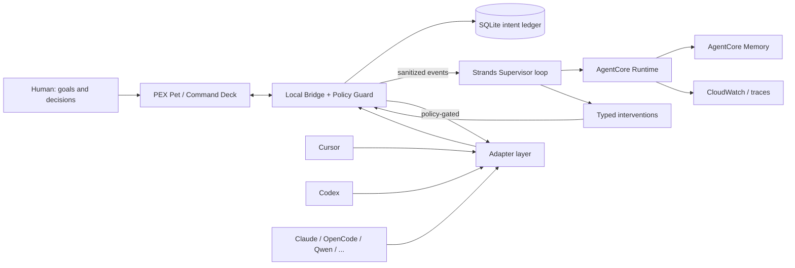

# Hackathon architecture diagram

FAQ requires: user input, Strands loop, tools/integrations, AWS services, output.

Cloud never bypasses local policy. Adapters are capability-negotiated, not assumed equal.
