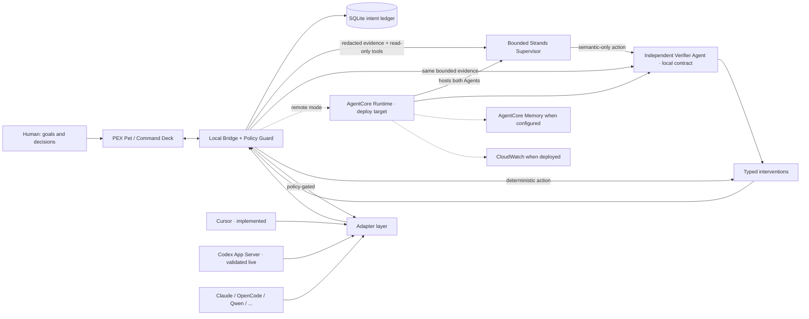

# Hackathon architecture diagram

FAQ requires: user input, Strands loop, tools/integrations, AWS services, output. The
diagram uses explicit evidence tiers: green is validated live in the controlled Codex
pair at `5c49c10`, blue is locally implemented/tested, and dashed gold is a deployment
target. The independent verifier is blue because the curated live receipt does not expose
judge-readable independent-verifier evidence.

Devpost image target: [`pex-architecture.png`](pex-architecture.png). It was regenerated
and visually inspected on 6 September from the current source; the verifier is visibly in
the blue local-contract tier:
[`pex-architecture.mmd`](pex-architecture.mmd).

Cloud never bypasses local policy. Verifier failure or evidence-free approval becomes NOOP. Adapters are capability-negotiated, not assumed equal. AgentCore, Memory, and CloudWatch are deploy/configuration targets, not current live-service claims.
