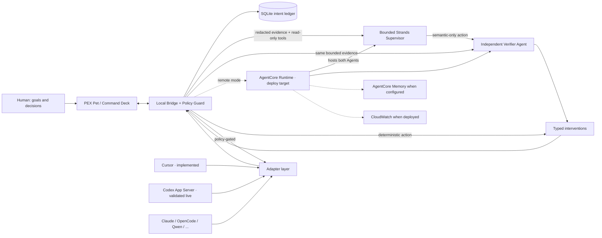

# Hackathon architecture diagram

FAQ requires: user input, Strands loop, tools/integrations, AWS services, output. The
diagram uses explicit evidence tiers: green is validated live in the controlled Codex
pair, blue is locally implemented/tested, and dashed gold is a deployment target.

Rendered image for Devpost: [`pex-architecture.png`](pex-architecture.png). Source: [`pex-architecture.mmd`](pex-architecture.mmd).

Cloud never bypasses local policy. Verifier failure or evidence-free approval becomes NOOP. Adapters are capability-negotiated, not assumed equal. AgentCore, Memory, and CloudWatch are deploy/configuration targets, not current live-service claims.
