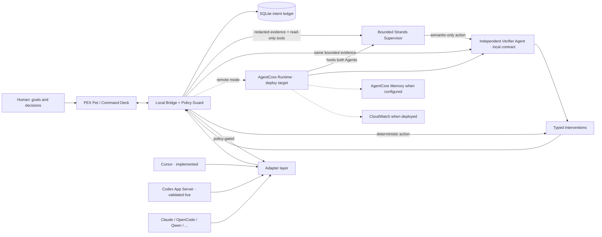

# Hackathon architecture diagram

## Current submission image — 10 September 2026

Use [pex-architecture.png](pex-architecture.png), regenerated from
[pex-architecture.mmd](pex-architecture.mmd) for the focused MVP.

The human owns goals and consequential decisions. PEX observes an attached
OpenCode HTTP or Codex App Server worker. Goal-bound evidence feeds the bounded
Strands supervisor; consequential corrections pass independent verification and
local policy before same-session delivery. Decisions and outcomes are recorded
in SQLite. The desktop exposes goals, inspection, pause and pet dismissal.

Zen BYOK uses the locally held vault credential; configuration does not guarantee
free usage. Green identifies the core local path, not exhaustive live coverage.
The dashed AgentCore option is implemented and offline-tested, **not deployed**.
It cannot bypass local policy. No deployed Memory or CloudWatch claim is made.
AgentCore deployment is optional under the refreshed official rules. See
[the focused shipping gate](../MVP_SHIP_GATE.md) and source-bound live evidence
in [the active handoff](../AGENT_HANDOFF.md). No formal comparative score is claimed.

## Historical diagram description — not the current submission image

FAQ requires: user input, Strands loop, tools/integrations, AWS services, output. The
diagram uses explicit evidence tiers: green is validated live in the controlled Codex
pair at `5c49c10`, blue is locally implemented/tested, and dashed gold is a deployment
target. The independent verifier is blue because the curated live receipt does not expose
judge-readable independent-verifier evidence.

Devpost image target: [`pex-architecture.png`](pex-architecture.png). It was regenerated on
6 September and re-reviewed at original resolution on 8 September against clean packaged
product source `d66e6a1`. Later repairs do not alter its depicted trust boundaries. It still
separates the controlled historical Codex/Strands live tier, locally implemented/tested tier,
and undeployed AgentCore target; the verifier remains visibly in the blue local-contract tier:
[`pex-architecture.mmd`](pex-architecture.mmd).

Cloud never bypasses local policy. Verifier failure or evidence-free approval becomes NOOP. Adapters are capability-negotiated, not assumed equal. AgentCore, Memory, and CloudWatch are deploy/configuration targets, not current live-service claims.
