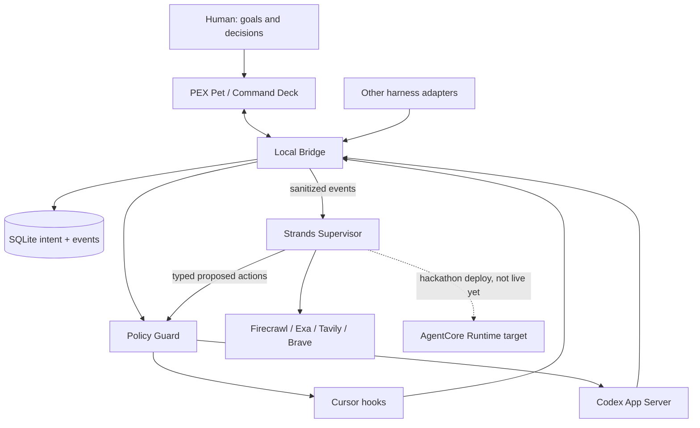

# Architecture

PEX is a personal adaptive control plane. The unit of optimization is the human + currently active AI workers + persistent intent.

## Invariants

- Local policy cannot be bypassed by the cloud supervisor.
- Typed actions only; no free-form shell from the model.
- Secrets are redacted before cloud.
- Adapter capabilities are negotiated, never assumed equal.
- Progress is evidence-based.
- AgentCore Runtime / Memory / CloudWatch are the hackathon deploy target. They are not claimed as live until deployed.

## Strands usage

The supervisor agent has tools (`get_goal`, `get_session_state`, `get_recent_events`, `get_scores`, `get_context`, `run_verification`, `web_search`, `scrape_url`, `propose_typed_action`). A Graph (supervisor → independent verifier) is used for high-stakes false-done / drift cases. Deterministic scoring stays in the bridge so token deltas do not each call a model. If no supervisor model is configured, triage is deterministic and `used_llm=false`.

AgentCore entrypoint: `python -m pex_supervisor.runtime` exposing `/invocations` and `/ping`. Image exists; runtime is not deployed.
