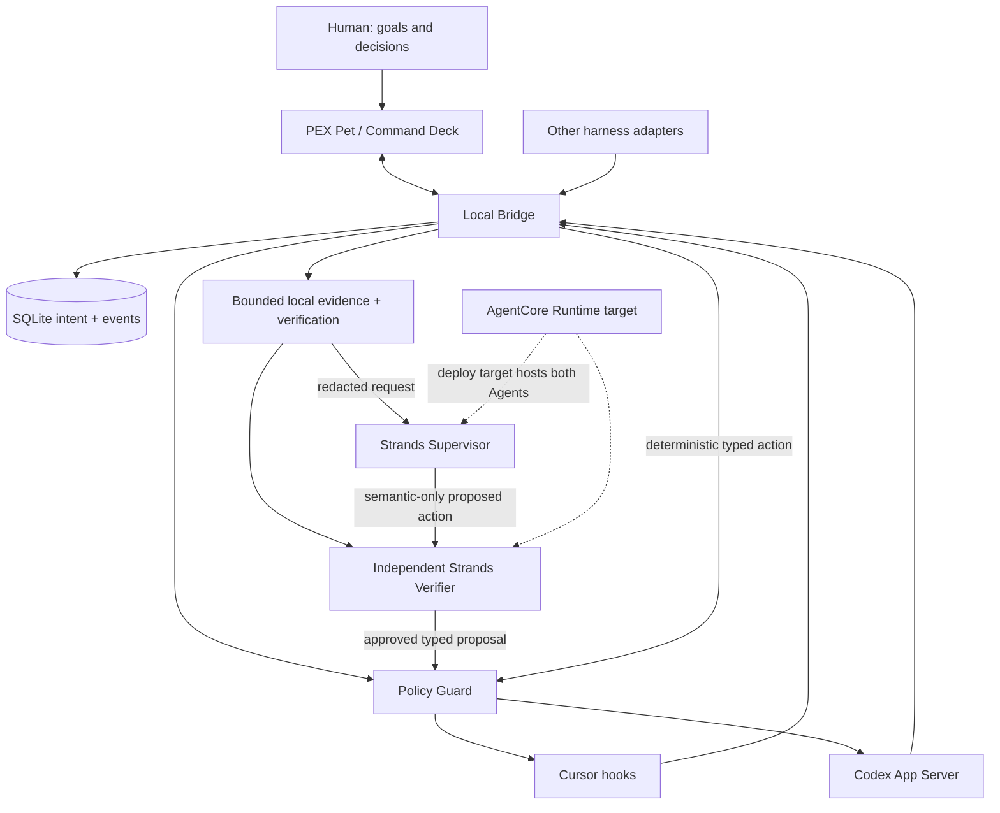

# Architecture

PEX is a personal adaptive control plane. The unit of optimization is the human + currently active AI workers + persistent intent.

## Invariants

- Local policy cannot be bypassed by the cloud supervisor.
- Typed actions only; no free-form shell from the model.
- Secrets are redacted before cloud.
- Adapter capabilities are negotiated, never assumed equal.
- Progress is evidence-based.
- AgentCore Runtime / Memory / CloudWatch are the hackathon deploy target. They are not claimed as live until deployed.

## Strands usage

The current live path creates one fresh Strands supervisor for each semantic STOP inspection and requires a validated structured decision. Six fresh request-scoped tools expose only the immutable redacted evidence already gathered by the bridge: goal, session state, recent events, scores, context, and the local verification receipt. They cannot execute code, read arbitrary files, call a harness, or mutate PEX. Their actual use is recorded in `evidence_tools`.

A semantic-only intervention must pass a second fresh independent verifier Agent over the same bounded evidence. Rejection, missing evidence, malformed output, failure, or timeout fails closed to deterministic NOOP. Locally evidenced completion/corrections remain authoritative, and local policy still owns execution. Deterministic scoring stays in the bridge so token deltas do not each call a model. If no supervisor model is configured, triage is deterministic and `used_llm=false`.

The previous unused verifier Graph was removed. The current two-Agent workflow is real but is not presented as a Strands Graph. Side-effect tools and public-web verification tools remain unimplemented rather than being exposed unsafely.

AgentCore entrypoint: `python -m pex_supervisor.runtime` exposing `/invocations` and `/ping`. Image exists; runtime is not deployed.
